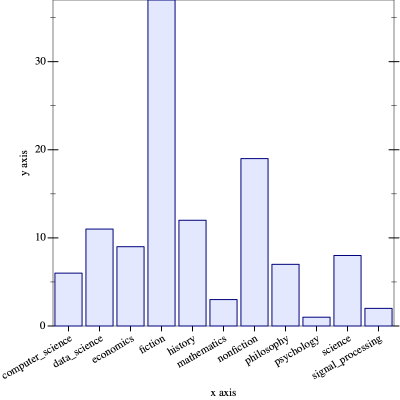

# Tabular Asa

A fast, efficient, in-memory, immutable, dataframes implementation for [Racket][racket].

# Quick Example

This is a brief example of loading a table from a CSV, filtering, grouping, aggregating, and plotting the data. _Note: This example uses `~>` from the [threading][threading] module for clarity, but Tabular Asa does not require it._

```racket
(require plot)
(require tabular-asa)
(require threading)

(define books (call-with-input-file "books.csv" table-read/csv))
 
(let ([df (~> books
              (table-drop-na '(Publisher))
              (table-cut '(Genre Title))
              (table-groupby '(Genre))
              (group-count))])
  (parameterize ([plot-x-tick-label-angle 30]
                 [plot-x-tick-label-anchor 'top-right])
    (plot (discrete-histogram (for/list ([x (table-column df 'Genre)]
                                         [y (table-column df 'Title)])
                                (list x y))))))
```

The above should produce a image plot like this:



# Installation

Installing should be as simple as using `raco` from the command line:

```zsh
% raco pkg install tabular-asa
```

After the above, you should be able to `(require tabular-asa)` and begin working!

# Documenation

Refer to the [scribble documentation][docs].

# License

This code is licensed under the MIT license. See the LICENSE.txt file in this repository for the complete text.

# fin.

[racket]: https://racket-lang.org/
[threading]: https://pkgs.racket-lang.org/package/threading
[docs]: https://docs.racket-lang.org/tabular-asa/index.html
